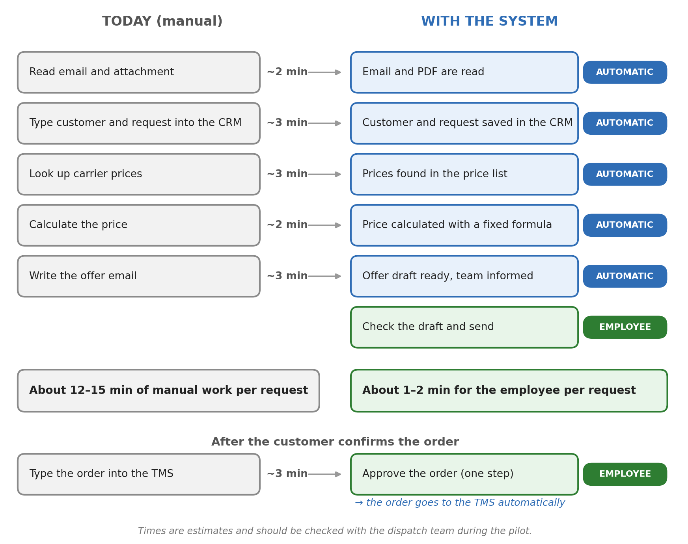
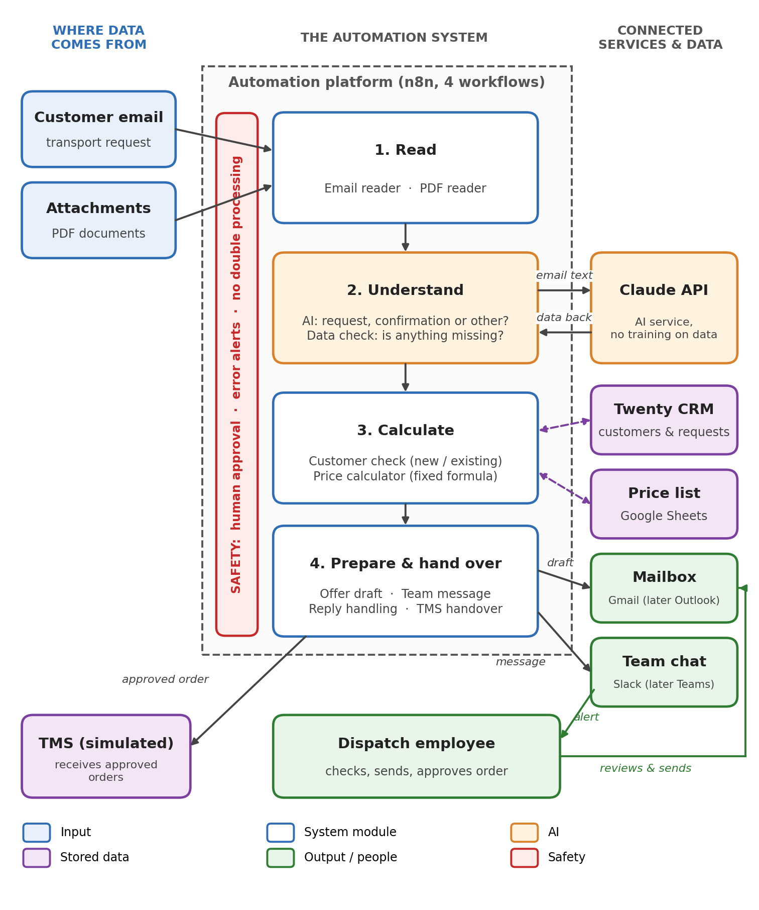

# AI Automation for Freight Forwarding: Transport Request → Offer → TMS

## The problem
Freight forwarders receive transport requests (RFQs) by email every day, and each one is written differently: weight in tonnes, only a number of pallets, details hidden in a PDF. For every request, an employee has to read the email, type the data into the CRM, look up carrier prices, calculate the price and write the offer. After the customer confirms, the order is typed into the TMS again.

This takes about **12–15 minutes of repetitive manual work per request**, slows down the response to the customer and creates a risk of typing errors.

## A real business process
The process automated here is taken from a **real freight forwarding company in Munich**, which defined it as the target process for automating its daily operations:

> Customer request by email → AI recognises and structures the transport data → new / existing customer is recognised → data is saved in the CRM → purchase prices are checked → reply draft is created → employee checks and sends → confirmed order is transferred to the TMS.

The company name is anonymised. All data in this repository is fictitious test data.

## The solution
A working prototype built with **n8n** that runs this process end to end, reducing the employee's work to two decisions: sending the offer and accepting the order.



### What it does
1. **Reads** incoming emails and PDF attachments.
2. **Understands** them with Claude (structured JSON output): new request, order confirmation or other.
3. **Validates** the data with plain code and asks the customer politely if something is missing.
4. **Recognises the customer** in the CRM (Twenty) and creates new customers and opportunities.
5. **Calculates the price** from the carrier price list: chargeable weight, fuel surcharge, customer margin. *The AI never calculates prices.*
6. **Prepares an offer draft** in the mailbox and informs the team in Slack. *Nothing is sent automatically.*
7. **Recognises customer replies** in the offer's email thread and suggests approval when the customer confirms.
8. **Hands approved orders to the TMS** and writes the TMS order number back to the CRM.

## Design principles
- **Human in the loop:** the system drafts and suggests; an employee sends offers and accepts orders.
- **AI only extracts, code decides:** prices, validation and routing rules are deterministic.
- **Nothing gets lost:** a reply in a known offer thread always reaches the team, independent of the AI's classification.
- **Idempotent:** every email is processed once; the TMS rejects an order it already has.
- **No silent failures:** problems with connected systems are reported to Slack by an error workflow.

## Architecture


| Workflow | Purpose |
|---|---|
| [`0_error_alerts`](workflows/0_error_alerts.json) | Posts every failed execution to Slack |
| [`1_rfq_intake_and_quote_draft`](workflows/1_rfq_intake_and_quote_draft.json) | Email → AI → validation → CRM → price → offer draft; customer replies |
| [`2_mock_tms_api`](workflows/2_mock_tms_api.json) | Simulated TMS REST endpoint (`201` / `200 duplicate` / `422`) |
| [`3_confirmed_order_to_tms`](workflows/3_confirmed_order_to_tms.json) | Won opportunity → TMS → order number back to the CRM (webhook + polling fallback) |

The JavaScript of all Code nodes is also available in [`workflows/code/`](workflows/code) for easier review.

| Prototype | Production replacement |
|---|---|
| Gmail | Microsoft Outlook / 365 |
| Slack | Microsoft Teams |
| Twenty CRM (self-hosted) | existing CRM |
| Google Sheets price list | Excel / database |
| Mock TMS (n8n) | existing TMS via API |
| Claude API | same, with a data processing agreement (AVV) |

## Documentation
- **Business Requirements Document:** [PDF](docs/BRD_Transport_Requests.pdf) · [Word](docs/BRD_Transport_Requests.docx)
- **Setup guide:** [docs/SETUP.md](docs/SETUP.md)
- **Test emails and expected results:** [docs/test-emails.md](docs/test-emails.md)
- Diagrams: [process flow](docs/images/process-flow.png) · [use case diagram](docs/images/use-case-diagram.png)

## Quick start
```bash
cd infra && cp .env.example .env   # set PG_DATABASE_PASSWORD and ENCRYPTION_KEY
docker compose up -d               # n8n :5678, Twenty :3000
```
Then follow [docs/SETUP.md](docs/SETUP.md) (Google Sheet, Twenty fields, credentials, import).

## Repository structure
```
docs/              BRD (PDF + Word), setup guide, test emails, diagrams
infra/             docker-compose for n8n + Twenty CRM, .env.example
sheet-templates/   Rates.csv (price list) and TMS_Orders.csv
workflows/         n8n workflow exports (credentials and secrets removed)
workflows/code/    JavaScript of the Code nodes
```

## Notes
- All data in this repository is fictitious test data; prices are example values.
- Workflow exports contain **no credentials or secrets**. Configure them in n8n after import.

Author: Eren Tarak
